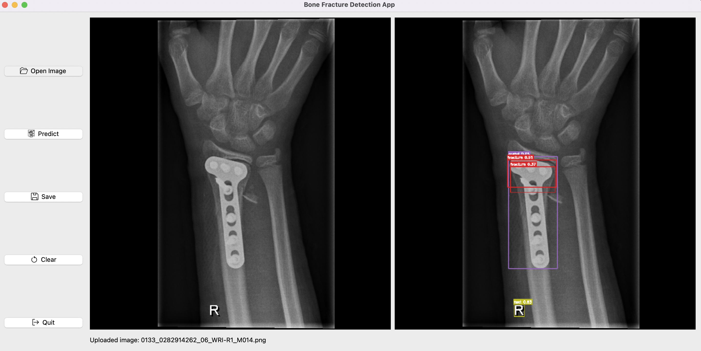

# YOLOv7 for Bone Fractures Detection

Trained YOLOv7 for bone fracture detections.
## Prepare folder

First download the YOLOv7 repo:

    git clone https://github.com/WongKinYiu/yolov7.git
    cd yolov7

Then download the GRAZPEDWRI-DX dataset and stored it in the `GRAZPEDWRI-DX_dataset` folder. Keep the YOLO annotations (`.txt` files) and extract the images from the `.zip` into the `images` folder.

## Conda environvment

    conda create -n yolov7 python=3.9
    conda activate yolov7
    pip install -r requirements.txt

## Download the models

You can download the models from `Releases` on the right banner. On the other hand you can also download them typing on your terminal:

    wget https://github.com/mdciri/YOLOv7-Bone-Fracture-Detection/releases/download/trained-models/yolov7-p6-bonefracture.onnx

or

    wget https://github.com/mdciri/YOLOv7-Bone-Fracture-Detection/releases/download/trained-models/yolov7-p6-bonefracture.pt

## ONNX Inference

It is available the ONNX model in `./yolov7-p6-bonefracture.onnx`, and inferece can be performed:

    python inference_onnx.py --model-path <onnx model path> --img-path <input image path> --dst-path <destination folder for predictions>

for example:

    python inference_onnx.py --model-path ./yolov7-p6-bonefracture.onnx --img-path ./GRAZPEDWRI-DX_dataset/images/test/0038_0775938745_03_WRI-L2_M014.png --dst-path ./predictions

You have to install the requirements:

    pip install onnx onnxruntime

## App GUI

    python gui/gui.py

The GUI is done using PySide6, so first install it with:

    pip install PySide6

*Fig2: Bone Fracture Detection GUI.*

## WebApp

    streamlit run app/webapp.py  

*Fig3: Bone Fracture Detection WebApp made with streamlit.*

## License

GNU General Public License v3.0 as the [YOLOv7 lincense](https://github.com/WongKinYiu/yolov7/blob/main/LICENSE.md).

